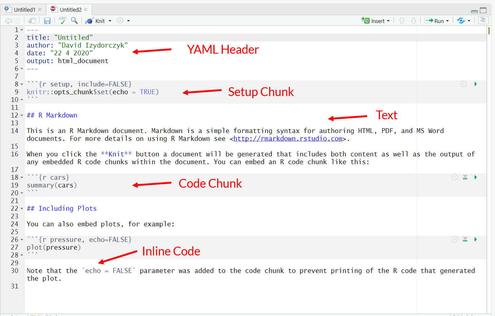
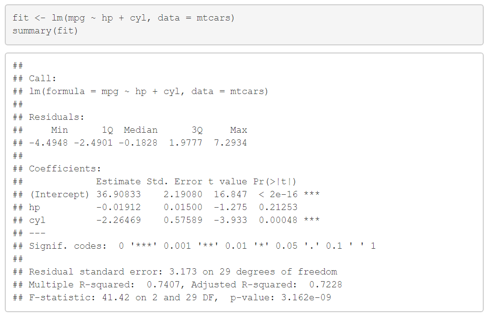
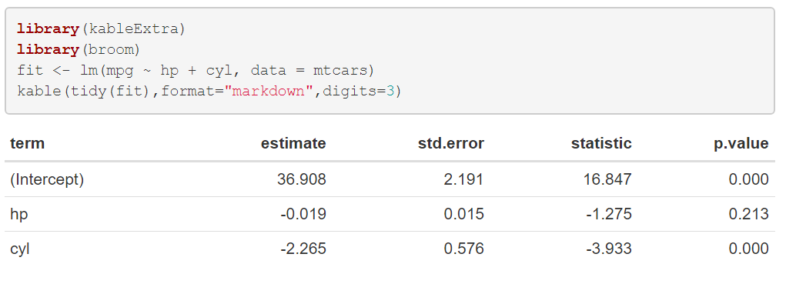

```{r setup, include=FALSE, message = FALSE, warning=FALSE}
options(htmltools.dir.version = FALSE)
library(tidyverse)
library(gganimate)
```


## Workshop

This workshop consists of three parts:

1. Introduction to R Markdown
2. Writing scientific articles with the [papaja](https://github.com/crsh/papaja) package
3. Introduction to Shiny Applications 

<!-- *********** NEW SLIDE ************** -->
---
## Learning Goals

At the end of this workshop, you should be able to:

- Know what `RMarkdown` is and how it works

- Know how to integrate code and data with `RMarkdown`

- Write APA conform manuscripts with the `papaja`-package

- Develop and deploy your own shiny app


<!-- *********** HEADING ************** -->
---
class: heading,middle


Part 1: Introduction to R Markdown


<!-- *********** NEW SLIDE ************** -->
---
## Why use R Markdown in the first place?

- `R Markdown` makes it easy to combine the power of `R` with the simplicity of Markdown documents

- `R` code and interpretations integrated into a single reproducible document, which can be easily shared
  - with your collaborators/colleagues
  - on OSF
  - or for your later self

- Separate the tasks of *reporting* the results (fun) from *formatting* the results (boring), which
  - decreases risk of copy-paste errors
  - decreases workload
  
- Has many applications:
  - make [presentations](https://bookdown.org/yihui/rmarkdown/presentations.html)
  - write scientific manuscripts with [papaja](https://github.com/crsh/papaja)
  - write books with [bookdown](https://bookdown.org/), e.g. https://bookdown.org/content/3686/
  - create websites with [blogdown](https://bookdown.org/yihui/blogdown/)

<!-- *********** NEW SLIDE ************** -->
---
## How does it work ? 


Source: rstudio.com


- Creating documents with `R Markdown` starts with an .Rmd file that contains a *combination* of **markdown** (content with simple text formatting) and **R code chunks**.

- The .Rmd file is fed to **knitr**, which executes all of the R code chunks and creates a new markdown (.md) document which includes the R code and it’s output.

- The markdown file generated by knitr is then processed by **pandoc** which is responsible for creating a finished  PDF, MS Word document, slide show, etc.


<!-- *********** NEW SLIDE ************** -->
---
## Getting Started - Creating a Markdown document

.center[

]


<!-- *********** NEW SLIDE ************** -->
---
class:content
## Structure

.pull-left3[
An `RMarkdown` document consists of 
- A YAML  header 
- Text
- Code Chunks
  - Setup Chunk
  - Other Chunks
- Inline Code

]
.pull-right3[

]

<!-- *********** HEADING ************** -->
---
class: heading, middle

YAML Header

<!-- *********** NEW SLIDE ************** -->
---
## YAML

```{r, eval = FALSE}
---
title: "My Title"
author: "Max Musterman"
date: "22 04 2020"
output: html_document
---
```

- `YAML` Stands for "YAML Ain't Markup Language"
- This is where you set options for your overall document
- See the Cheat-Sheet or https://rmarkdown.rstudio.com/html_document_format.html

<!-- *********** NEW SLIDE ************** -->
---
## YAML - Output

For example, you can change the [output format](https://rmarkdown.rstudio.com/formats.html) (`html_document`, `pdf_document`, `word_document`, `github_document`, ...)


.pull-left[

```{r, eval = FALSE}
---
title: "My Title"
author: "Max Musterman"
date: "22 04 2020"
output: pdf_document #<<
---
```


]


.pull-right[

```{r, eval = FALSE}
---
title: "My Title"
author: "Max Musterman"
date: "22 04 2020"
output: word_document #<<
---
```


]


<!-- *********** NEW SLIDE ************** -->
---
## YAML - Table of Contents

... add and format the table of contents 


.pull-left[

```{r, eval = FALSE}
---
title: "My Title"
author: "Max Musterman"
date: "22 04 2020"
output:            
    html_document: 
      toc: TRUE      #<<
      toc_depth: 2   #<<
---
```


]


.pull-right[

```{r, eval = FALSE}
---
title: "My Title"
author: "Max Musterman"
date: "22 04 2020"
output:            
    html_document: 
      toc: TRUE      
      toc_depth: 2
      toc_float: true#<<
---
```


]


<!-- *********** NEW SLIDE ************** -->
---
## YAML - Appearance

... change the appearance of [themes](https://www.datadreaming.org/post/r-markdown-theme-gallery/) and [code syntax](https://www.garrickadenbuie.com/blog/pandoc-syntax-highlighting-examples/) 


.pull-left[

```{r, eval = FALSE}
---
title: "My Title"
author: "Max Musterman"
date: "22 04 2020"
output:            
    html_document
---
```


]


.pull-right[

```{r, eval = FALSE}
---
title: "My Title"
author: "Max Musterman"
date: "22 04 2020"
output:            
    html_document: 
      theme: journal       #<<
      highlight: breezedark#<<
---
```


]


<!-- *********** NEW SLIDE ************** -->
---
## YAML - Code Chunks

... make code chunks foldable (`show/hide` as default): 


```{r, eval = FALSE}
---
title: "My Title"
author: "Max Musterman"
date: "22 04 2020"
output:            
    html_document: 
      code_folding: show #<<
---
```


.center[


]

<!-- *********** HEADING ************** -->
---
class: heading, middle

Text Formatting

<!-- *********** NEW SLIDE ************** -->
---
## Sections 

See also the Cheat-Sheet and https://rmarkdown.rstudio.com/authoring_basics.html

.pull-left[
Levels of Headings

```{r eval=FALSE}
# Section 1
bla

## Section 1.1
bla

### Section 1.1.1
bla

#### Section 1.1.1.1

```
]

.pull-right[

# Section 1
bla
## Sub-Section 1.1
bla
### Paragraph 1.1.1
bla
#### Sub-Paragraph 1.1.1.1

]

You can use also use the options `number_sections: true` in the YAML header

<!-- *********** NEW SLIDE ************** -->
---
class: small

## Text Formatting 

.pull-left[
Emphasis
```{r eval=FALSE}
__bold__  (or use *)
_italic_
~~strikethrough~~
```

***
Lists
```{r eval=FALSE}
- unordered list 
    - sub-item 1 
     
1. ordered list 
2. item 2 
    + sub-item 1 
```

***
Tables

```{r eval=FALSE}
Table Header  | Second Header 
------------- | ------------- 
Table Cell    | Cell 2        
Cell 3        | Cell 4
```

]

.pull-right[

<br>

- __bold__  (or use *)
- _italic_
- ~~strikethrough~~

***
- unordered list 
- item 2 
    - sub-item 1 
    
     
1. ordered list 
2. item 2 
    1. sub-item 1 

***
<br>

Table Header  | Second Header 
------------- | ------------- 
Table Cell    | Cell 2        
Cell 3        | Cell 4

]


<!-- *********** NEW SLIDE ************** -->
---
## Links & Images


.pull-left[
You can also add links

```{r eval=FALSE}
[Click me!](https://google.com/)
```

[Click me!](https://google.com/)
]

.pull-right[

or images (see [here](https://stackoverflow.com/questions/25166624/insert-picture-table-in-r-markdown) for other ways to add images)

```{r eval=FALSE}

```


]


<!-- *********** NEW SLIDE ************** -->
---
## HTML & LaTeX


You can also directly use `HTML` code

```{r eval=FALSE}
<b> this is bold </b>

<font color ="#FF8C00">Orange text</font>
```

<b> this is bold </b>
<font color ="#FF8C00">Orange text</font>

***

or Math expressions with `LaTeX`

```{r eval=FALSE}
$f(k) = {n \choose k} p^{k} (1-p)^{n-k}$
```

$f(k) = {n \choose k} p^{k} (1-p)^{n-k}$

use `$$` for display style (same as `"\begin{equation} ... \end{equation}"`)

$$f(k) = {n \choose k} p^{k} (1-p)^{n-k}$$


<!-- *********** HEADING ************** -->
---
class: heading, middle

R Code 

<!-- *********** NEW SLIDE ************** -->
---
## Code chunks
.pull-left2[
- You can create code chunks with the shortcut <kbd>Strg</kbd>+<kbd>Alt</kbd>+<kbd>I</kbd>.

- Run a code chunk with <kbd>Ctrl</kbd> + <kbd>Shift</kbd> + <kbd>Enter</kbd>

````
`r ''````{r}
4 + 2
rnorm(2)
```


```{r }
4 + 2
rnorm(2)
```
]


.pull-right2[
Some important chunk options (see also [here](https://yihui.org/knitr/options/#chunk-options)):

-  names -> will show up in the outline
- `echo`: Display code in output document (default = `TRUE`)
- `include`: Include chunk and output in doc after running (default = `TRUE`)
- `fig.height` and `fig.width`: Dimensions of plots in inches
- `error`: Display error messages in doc (`TRUE`) or stop render when errors occur (`FALSE`) (default = `FALSE`)
- `warning`: display code warnings in document (default = `TRUE`)
- `results`: How to format results:
  - default = `'markup'`
  - `'asis'` - pass through results
  - `'hide'` - do not display results
- `cache`: cache results for future knits (default = `FALSE`)
]


<!-- *********** NEW SLIDE ************** -->
---
## Inline R Code

You can use inline `R` code like this: 

```{r  eval=FALSE}
This is the mean `r mean(rnorm(100))` 
```

becomes: This is the mean `r mean(rnorm(100))` 


<br><br>

And you can combine it with `LaTeX` math expressions

```{r  eval=FALSE}
This is the mean $M_{age} = `r rnorm(100,22,10) %>% mean() %>%  round()`$
```

becomes: This is the mean $M_{age} = `r  rnorm(100,22,10) %>% mean() %>%  round()`$


<!-- *********** HEADING ************** -->
---
class: heading, middle

Taking Advantage of R


<!-- *********** NEW SLIDE ************** -->
---
## Make nicer tables  with kableExtra and DT 

Normal Output: 

```{r}
head(iris,10)
```

<!-- *********** NEW SLIDE ************** -->
---
## Make nicer tables  with kableExtra and DT 

With `kable()`: 

```{r message=FALSE}
library(kableExtra)

kable(head(iris,10))
```


<!-- *********** NEW SLIDE ************** -->
---
## Make nicer tables  with kableExtra and DT 

With  `data.table()` from the [DT package](/https://rstudio.github.io/DT/) : 

```{r message=FALSE}
library(DT)
DT::datatable(head(iris,10),
          filter  = list(position = 'top', clear = TRUE, plain = FALSE),
          options = list(
            lengthMenu = list(c(2, 3 , -1), c('2', '3',  'All')), pageLength = 3
          ))
              
```


<!-- *********** NEW SLIDE ************** -->
---
## Make nicer tables  with kableExtra and DT 

Also check out the YAML option `df_print: paged`


.pull-left[

```{r, eval = FALSE}
---
title: "Untitled"
author: "David Izydorczyk"
date: "22 4 2020"
output: 
  html_document
---
```


]


.pull-right[

```{r, eval = FALSE}
---
title: "Untitled"
author: "David Izydorczyk"
date: "22 4 2020"
output: 
  html_document:
    df_print: paged#<<
---
```


]


<!-- *********** NEW SLIDE ************** -->
---
## Nicer output  with [broom](https://cran.r-project.org/web/packages/broom/vignettes/broom.html)

From the documentation: "The [broom](https://cran.r-project.org/web/packages/broom/vignettes/broom.html) package takes the messy output of built-in functions in R, such as lm, nls, or t.test, and turns them into tidy data frames."

Works with results from `lm, glm, t.test, cor.test, wilcox.text (and lme4 with broom.mixed)`


.pull-left[
Normal `lm()` output: 



]
.pull-right[
With `tidy()` from `broom` :



]


<!-- *********** NEW SLIDE ************** -->
---
## Make nicer plots with [plotly](https://plotly-r.com/index.html)   

.pull-left[
Normal `ggplot2` output: 

```{r fig.height=3, fig.width= 4, dev='svg'}
library(ggplot2)

ggplot(chickwts,aes(x=feed,y=weight)) +
  geom_boxplot() +
  theme_bw()

```

]
.pull-right[
With plotly

```{r  message=FALSE,fig.height=4.5, fig.width= 6, dev='svg'}
library(plotly)

p <- ggplot(chickwts,aes(x=feed,y=weight)) +
        geom_boxplot() +
        theme_bw()
ggplotly(p) #<<
```
]


<!-- *********** NEW SLIDE ************** -->
---
## Make gifs with  [gganimate](https://gganimate.com/) 


```{r gif, cache =TRUE}
library(gganimate)

N      = 500
pHeads = 0.5
 
flipSequence <- sample(x=c(0,1),prob = c(1-pHeads,pHeads),size=N,replace=T)
flip_data    <- data.frame(run=1:N,prop=cumsum(flipSequence)/1:N)

g <- ggplot(flip_data,aes(x=run,y=prop,frame=run)) +
      geom_line(size=1)+
      geom_segment(aes(xend = N-20, yend = prop), linetype = 2, colour = 'grey') + 
      geom_point(aes(x = run),color = "tomato1",size = 2) + 
      geom_text(aes(x = N-20, label = round(prop,2)), hjust = 0) +
      xlim(1,500)+ylim(0.0,1.0)+
      geom_hline(yintercept = pHeads)+
      ggtitle("Running Proportion Heads of Unbiased Coin")+
      ylab("Proportion of Heads")+
      xlab("Flip Number") +
      theme_bw()+
      transition_reveal(run) +
      coord_cartesian(clip = 'off') 

```

---

```{r}
animate(g, height = 400, width = 700,nframes=50,fps=10)
```


<!-- *********** NEW SLIDE ************** -->
---
class: small
## Interactive Plots with runtime: shiny 

You can also use shiny elements in your HTML - Markdown document or presentation

```{r, eval = FALSE}
---
title: "Untitled"
author: "David Izydorczyk"
date: "22 4 2020"
output: html_document
runtime: shiny #<<
---

# start code chunk ```{r}

library(dplyr)
library(ggplot2)
  
inputPanel(
  numericInput("Mean"  , label = "Mean" ,value = 0)
)

# This functionblock gets executed everytime one of the input changes

renderPlot({

m   <- input$Mean
  
rnorm(100,m,5) %>% as.data.frame %>% 
 ggplot(aes(x=.)) +
  geom_histogram(aes(y=..density..)) +
  geom_density(aes(y=..density..),fill="tomato1",alpha=0.4) +
  theme_bw()
})
# end code chunk 

```


<!-- *********** NEW SLIDE ************** -->
---
## Now it's your turn !

Create an `RMarkdown` file and delete everything execpt the YAML header and the setup chunk

Create the following section structure:
  1. Setup
    1.1 Packages 
    1.2 Data
  2. Summary
  3. Plot
  
Load the `ggplot2` package (`library(ggplot2)`) in a code chunk in the `1.1 Package` section you just created

Load the [happiness2017](https://www.kaggle.com/unsdsn/world-happiness/version/2#2017.csv) from the data folder in a code chunk in the `Data` section (`read.csv("Part 1 - Markdown/Data/happines2017")`)

Print the top of the dataframe (`data[1:5,]`)) in a code chunk in the `Summary` section, try using `datatable()` or  `kable()` (maybe you need to install the `DT` and the `kableExtra`packages first).

Compute some summaries or linear regression (e.g. using `summary()/lm()`) for some variables you are interested in, in a code chunk in the `Summary` section.

<!-- *********** NEW SLIDE ************** -->
---
## Now it's your turn !

Write some text describing the results using some of the text formatting options and inline R-code. 

Write some math expressions with `LaTeX`. 

Plot the `happiness.Score` of a country by its GPD (`Economy..GDP.per.Capita.`) or anything else that you are interested in, e.g. by using `ggplot(data,aes(x = Happiness.Score, y = Economy..GDP.per.Capita.))+geom_point()`.  Try using `ggplotly`.

Play around with YAML options, add some table of content, change the output format.

Play around with the chunk options, what happens if you set a chunk to `echo=FALSE` or `include = FALSE` ? 


<!-- *********** NEW SLIDE ************** -->
---
## Helpful references:

- https://bookdown.org/yihui/rmarkdown


