```{r setup, include=FALSE, message = FALSE, warning=FALSE}
options(htmltools.dir.version = FALSE)
library(tidyverse)
library(papaja)
```


class: heading,middle

Part 2: Writing scientific articles with the [papaja](https://github.com/crsh/papaja) package


<!-- *********** NEW SLIDE ************** -->
---
## The papaja package

- So far we learned how to use `R Markdown` to create reproducible reports

- `Papaja` allows us to write an entire paper in `R`, automatically createing results, tables, graphs and references, and everything in APA-format ! 

- `Papaja`  = "Prepare APA Journal Articles"


<!-- *********** NEW SLIDE ************** -->
---
## Note

.pull-left[
The papaja package was developed by [Frederik Aust](http://methexp.uni-koeln.de/?page_id=1603&lang=de). 

.center[**All credit goes to him.**]
]

.pull-right[

]

<!-- *********** NEW SLIDE ************** -->
---
## The papaja  package

From the [github documentation](https://crsh.github.io/papaja_man/introduction.html):

"papaja is short for ‘preparing APA journal articles’ and is the name of this R package designed to create fully reproducible journal articles that seamlessly fuse statistical analyses, simulations, and prose. A manuscript written with papaja can be thought of as an extensively commented analysis script ready for publication in a scientific journal." 

<!-- *********** NEW SLIDE ************** -->
---
## Installing papaja

`papaja` is not yet available on CRAN but you can install it from github:

```{r eval = FALSE}
 # Install devtools package if necessary
if(!"devtools" %in% rownames(installed.packages())) install.packages("devtools")

# Install the stable development verions from GitHub
devtools::install_github("crsh/papaja")
```


<!-- *********** NEW SLIDE ************** -->
---
## Creating a document
.center[
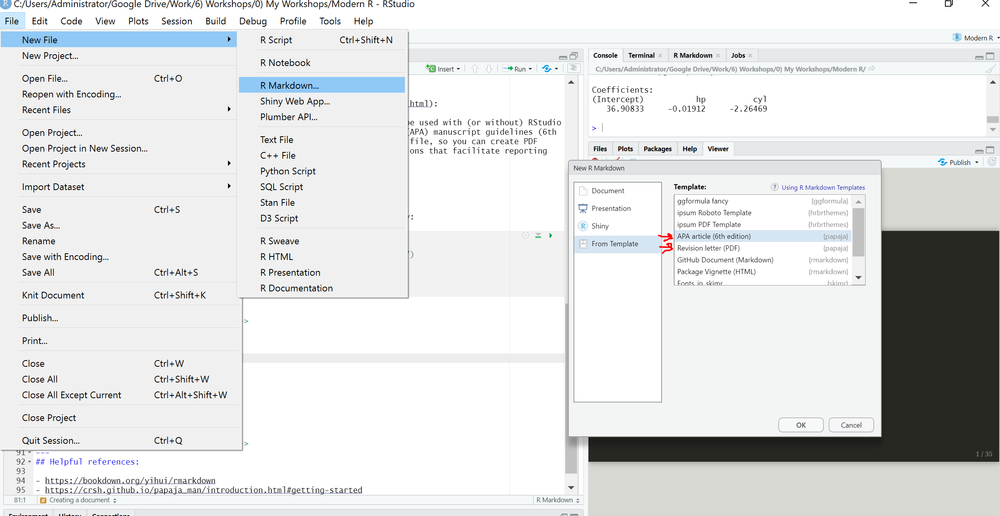
]


<!-- *********** NEW SLIDE ************** -->
---
## The document

The document has the same structure as the `R Markdown` document we worked with before. It has a YAML header, a body with Markdown headings and texts and some code chunks.


.center[
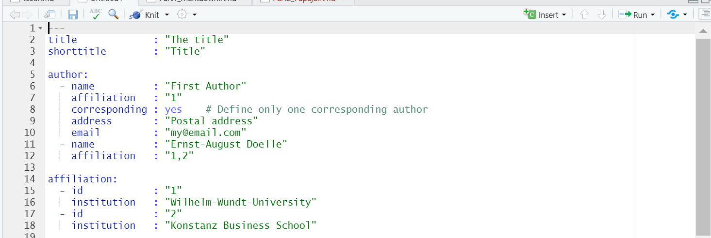
]

<!-- *********** NEW SLIDE ************** -->
---
## The document

If you press `knit` multiple files are create in the folder you saved your .Rmd in:

1. a .pdf containing the finished document
2. a .tex file containing the `LaTeX` code used to make the pdf
3. a .log file containing the log of the `LaTeX` distribution

<br>

.center[
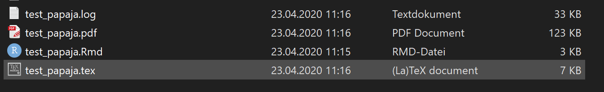
]


<!-- *********** NEW SLIDE ************** -->
---
## Your turn ! 

- Install `papaja`
- Create and knit your first `papaja` document


<!-- *********** NEW SLIDE ************** -->
---
## YAML Options

From the [manual](https://crsh.github.io/papaja_man/r-markdown-components.html#body):

.pull-left[

]
.pull-right[

]


<!-- *********** NEW SLIDE ************** -->
---
class: heading,middle

Reporting Statistical Analyses

<!-- *********** NEW SLIDE ************** -->
---
## Reporting Statistical Analyses

- One of the main advantages of `papaja` are the helper functions `printnum(), apa_print(), apa_table()` for reporting the results of your analyses

<!-- *********** NEW SLIDE ************** -->
---
## Reporting Statistical Analyses

`printnum()` converts numeric values to character strings for reporting. 

.pull-left[

```{r eval=FALSE}
# Means
printnum(34.57927373)
printnum(34.57927373,digits = 3)

# Correlations
printnum(0.73,gt1 = TRUE) 
printnum(0.73,gt1 = FALSE) 

# P-Values
printp(0.8)
printp(0.034)
printp(0.0001)

# Specific formats
printnum(80303383839,format="e")
printnum(80303383839,format="E")
```
]
.pull-right[

```{r echo=FALSE}
printnum(34.57927373)
printnum(34.57927373,digits = 3)

printnum(0.73,gt1 = TRUE) 
printnum(0.73,gt1 = FALSE) 


printp(0.8)
printp(0.034)
printp(0.0001)


printnum(80303383839,format="e")
printnum(80303383839,format="E")
```
]


<!-- *********** NEW SLIDE ************** -->
---
## Reporting Statistical Analyses

Example in text: 

```{r eval = FALSE}
The mean of speed is `r  printnum(mean(cars$speed))` 
```

&nbsp; becomes: The mean speed is `r  printnum(mean(cars$speed))`


or 

```{r eval = FALSE}
The Bayes Factor is BF = `r  printnum(printnum(803033838,format="e"))` 
```

&nbsp; becomes: The Bayes Factor is BF = `r  printnum(printnum(803033838,format="e"))`


So even if my data changes (i.e., change the model, fix an error, exclude some participants, transform the variable etc. ), you don't have to care about the reported numbers. 


<!-- *********** NEW SLIDE ************** -->
---
## Reporting Statistical Analyses

- `apa_print()` takes objects from various statistical methods to create formatted character strings to report the results in accordance with APA manuscript guidelines

- `apa_print()` currently supports the following output objects

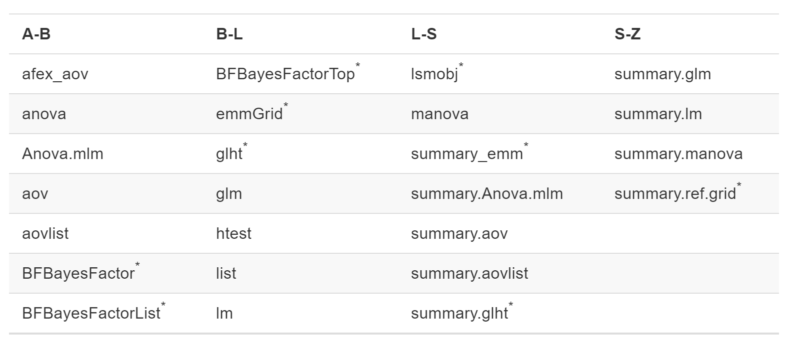

<!-- *********** NEW SLIDE ************** -->
---
class: small
## Reporting Statistical Analyses

- `apa_print()`  returns a `list`-object with different reporting option, such as:
  - estimates (e.g, *mean differences, regression coefficients*)
  - statistics  (e.g., *t,F,df,p*)
  - full results string (estimate + statistics)
  - results table

Example:

```{r}
fit <- lm(mpg ~ hp * cyl, data = mtcars) # fit regression
apa_print_fit = apa_print(fit) # save output of apa_print()
```


.pull-left[

```{r}
apa_print_fit$estimate$modelfit$r2

apa_print_fit$statistic$hp

apa_print_fit$full_result$hp
```
]
.pull-right[

`r apa_print_fit$estimate$modelfit$r2`

<br>

`r apa_print_fit$statistic$hp`

<br>

`r apa_print_fit$full_result$hp`

]


<!-- *********** NEW SLIDE ************** -->
---
## Tables

- `apa_print()` also allows to return a table with `apa_table()`

```{r, eval = FALSE} 
fit <- lm(mpg ~ hp * cyl, data = mtcars)
apa_print_fit = apa_print(fit)

apa_table(apa_print_fit$table,caption = "This is a regression table",note="Cool Table")
```

.center[
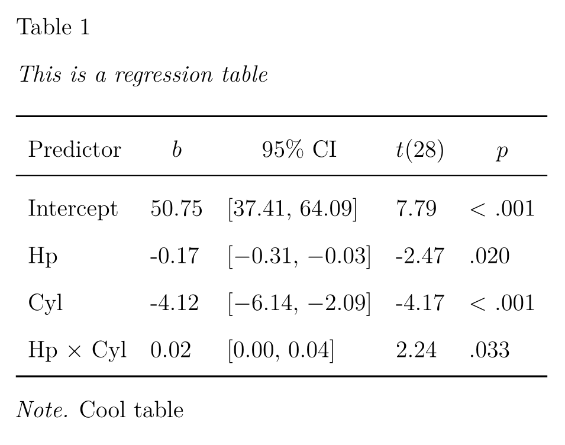
]

<!-- *********** NEW SLIDE ************** -->
---
## Tables

- You are also able to use `LaTeX` expressions if necessary

```{r, eval = FALSE} 
fit <- lm(mpg ~ hp * cyl, data = mtcars)
apa_print_fit = apa_print(fit)

apa_table(apa_print_fit$table,caption = "This is a regression table",
          note="$M_I$ $//frac{3}{4}$ ", escape=TRUE) #<<
```

.center[
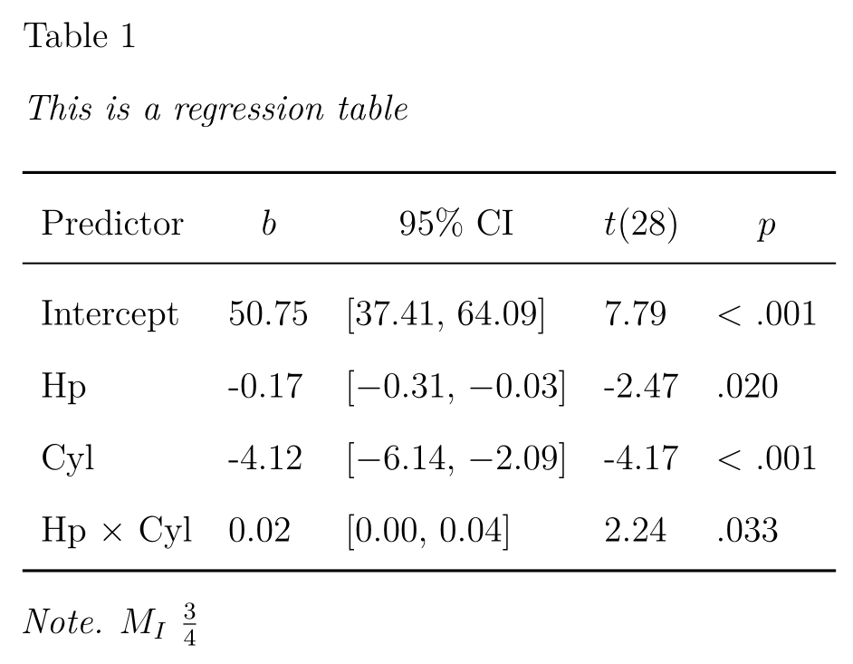
]


<!-- *********** NEW SLIDE ************** -->
---
## Tables

You can also make your own custom tables with `kable()`

First we need to create a `data.frame` containing our data we want to put into the table.

```{r}

(temp0 <- mtcars %>% 
        group_by(gear) %>% 
        summarize(mean = mean(mpg),
                  sd   = sd(mpg),
                  corr = cor.test(mpg,hp)$estimate,
                  p    = cor.test(mpg,hp)$p.value) %>%
        as.data.frame()) # as.data.frame is only for demonstration purposes


```


<!-- *********** NEW SLIDE ************** -->
---
## Tables

Now we have to bring the values in our `data.frame` in the format we want them to have.

```{r}
(temp1 <-  temp0 %>% 
              mutate(mean = printnum(mean),
                     sd   = printnum(sd), 
                     corr = printnum(corr,gt1=FALSE),
                     p    = printp(p))  %>%
              as.data.frame())
```


<!-- *********** NEW SLIDE ************** -->
---
## Tables


Now we can use `kable()` to create a `LaTeX` table

.pull-left[

```{r message=FALSE}
library(kableExtra)
kable(temp1 ,format = "latex",booktabs=TRUE)
```

]
.pull-right[

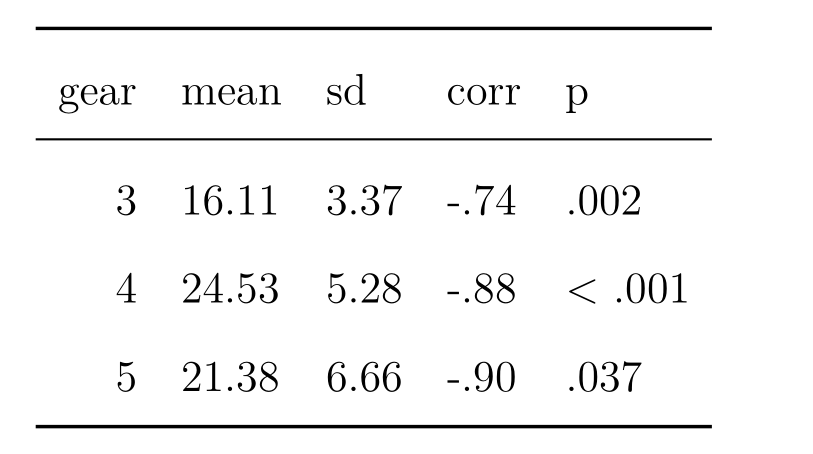

]
<!-- *********** NEW SLIDE ************** -->
---
class: small
## Tables

We can align the columns and change the column names

.pull-left[

```{r message =FALSE}
library(kableExtra)

temp1 %>%
  kable(.,format    = "latex",booktabs=TRUE,
          align     = "c", #<<
          col.names = c("Gears","$M$","$SD$", #<<
                        "$r$","p"),#<<
          escape    =  FALSE) #<<
```

]
.pull-right[

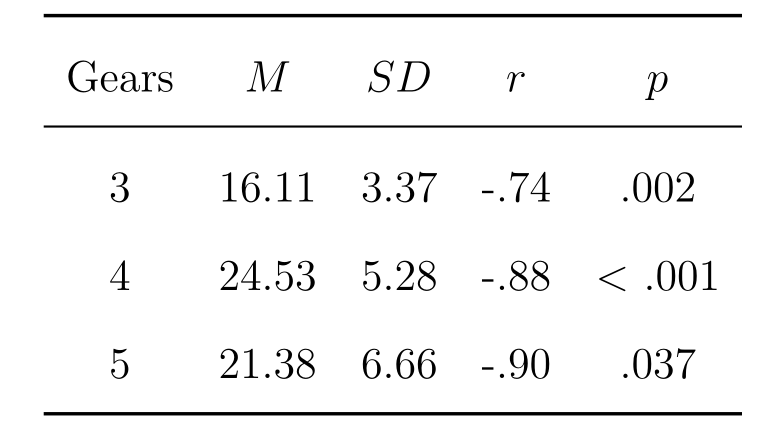

]


<!-- *********** NEW SLIDE ************** -->
---
class: small
## Tables

We can add notes and captions

.pull-left[

```{r eval = FALSE}
library(kableExtra)

temp1 %>%
  kable(.,format    = "latex",booktabs=TRUE,
          align     = "c",
          col.names = c("Gears","$M$","$SD$",
                        "$r$","p"),
          caption   = "This is a caption",
          escape    =  FALSE) %>% #<<
  footnote(general  = "This is a note", #<<
           footnote_as_chunk = TRUE, #<<
           threeparttable    = T, #<<
           escape            = F, #<<
           general_title     = "Note.", #<<
           title_format      = c("italic")) #<<
```

]
.pull-right[

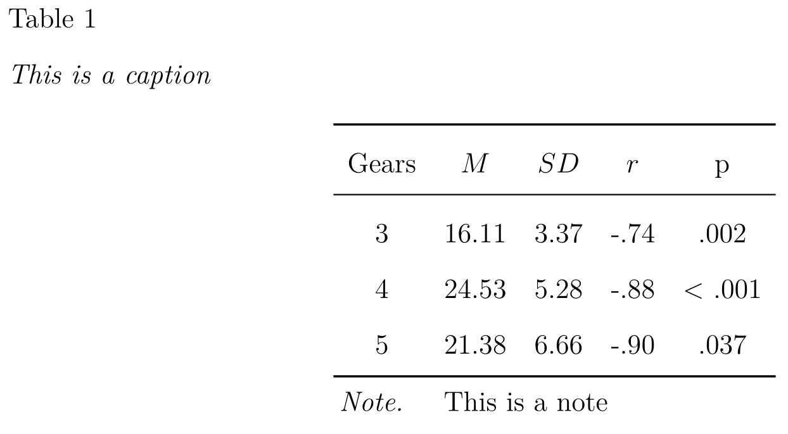

]


<!-- *********** NEW SLIDE ************** -->
---
class: small
## Tables

Add more detail

.pull-left[

```{r eval = FALSE}
library(kableExtra)

temp1 %>%
  kable(.,format    = "latex",booktabs=TRUE,
          align     = "c",
          col.names = c("Gears","$M$","$SD$",
                        "$r$","p"),
          caption   = "This is a caption",
          escape    =  FALSE) %>% 
  footnote(general  = "This is a note", 
           footnote_as_chunk = TRUE,
           threeparttable    = T,
           escape            = F, 
           general_title     = "Note.", 
           title_format      = c("italic")) %>%
  add_header_above(c(" " = 1,
                     "Estimates" = 3)) #<<
```

]
.pull-right[

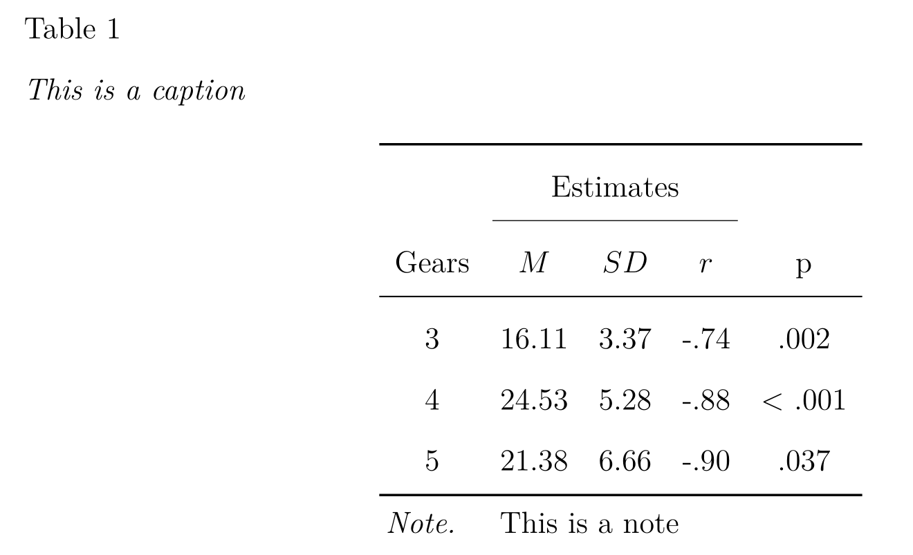

]

<!-- *********** NEW SLIDE ************** -->
---
class: small
## Tables

Works even for complexe tables:

.pull-left[

```{r eval = FALSE}
library(kableExtra)

df <- data.frame(cond = rep(c("exp","cont"),each=10),
                 grp  = rep(c("old","young"),times=10),
                 rt   = rnorm(20,500,70)) %>% 
      group_by(cond,grp) %>% 
      summarize(M  = mean(rt),
                sd = sd(rt),
                n  = length(rt))

df  %>% 
  kable(.,format    = "latex",booktabs=TRUE,
          align     = "c",
          col.names = c("Condition","Group","$M$","$SD$","$n$"),
          caption   = "This is a caption",
          escape    =  FALSE,
          digits    = 2) %>% #<<
  collapse_rows(columns = 1:2,
                latex_hline = "major",
                valign = "middle") #<<
```

]
.pull-right[

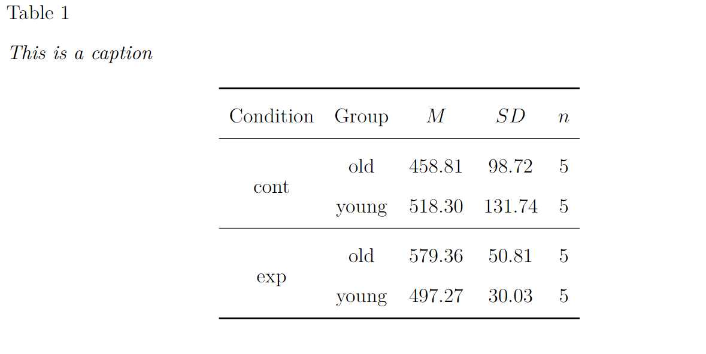

]


<!-- *********** NEW SLIDE ************** -->
---
class: small
## Tables

However, some things can be very hard, for instance aligning numbers with with leading 0 at the decimal point, as the `p` column in our initial example. The "solution" in the [manual](http://haozhu233.github.io/kableExtra/awesome_table_in_pdf.pdf) depends on including an additional LaTeX package in the YAML header. However, this package adds-leading-0 since the newest release and the option to turn this off, doesn't work any more .... ... .. . .. . 

.pull-left[

Add in YAML 

```{r eval = FALSE}
header-includes :#<<
   - \usepackage{siunitx}#<<
   - \newcolumntype{d}{S[table-format=< .3,table-comparator = true]}#<<
```


```{r eval = FALSE}
library(kableExtra)

temp1 %>%
  kable(.,format    = "latex",booktabs=TRUE,
          align     = "ccccd", #<<
          col.names = c("Gears","$M$","$SD$",
                        "$r$","p"),
          caption   = "This is a caption") %>% 
  footnote(general  = "This is a note", 
           footnote_as_chunk = TRUE,
           threeparttable    = T,
           escape            = F, 
           general_title     = "Note.", 
           title_format      = c("italic")) %>%
  add_header_above(c(" " = 1,"Estimates" = 3))
```

]
.pull-right[

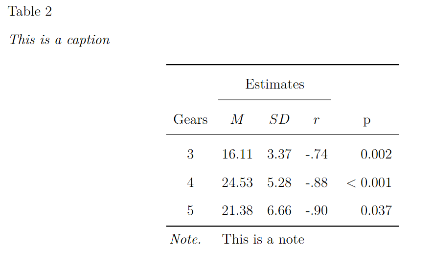

]


<!-- *********** NEW SLIDE ************** -->
---
class: small
## Tables

Ugly possible workaround:

.pull-left[

```{r eval = FALSE}
temp1 %>%
  mutate(p = ifelse(grepl("< ",p),
                    p, paste0("\\quad ",p))) %>%  #<<
  kable(.,format    = "latex",booktabs=TRUE,
          align     = "ccccc", 
          col.names = c("Gears","$M$","$SD$",
                        "$r$","p"),
          caption   = "This is a caption",
          escape    =  FALSE) %>% 
  footnote(general  = "This is a note", 
           footnote_as_chunk = TRUE,
           threeparttable    = T,
           escape            = F, 
           general_title     = "Note.", 
           title_format      = c("italic")) %>%
  add_header_above(c(" " = 1,"Estimates" = 3))

```

]
.pull-right[

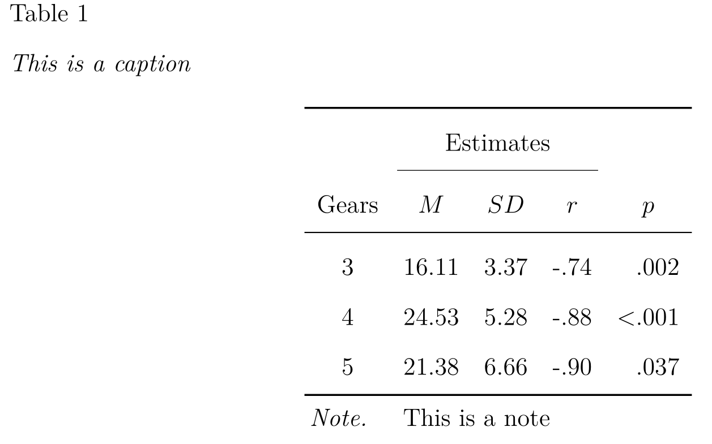

]


<!-- *********** NEW SLIDE ************** -->
---
## Your turn ! 

- load the `StudentsPerformance` data  (`read.csv("Data/StudentsPerformance.csv")`)

- make a publication ready table with `kable()` with the median, maximum, and minimum of `writing.score` and the correlation with `reading.score`

- calculate a ANOVA comparing `math.score` with `gender` and `parental.level.of.education` as between factors (`aov(math.score ~ gender + parental.level.of.education, data = data)` ))

- print your results for the factor `gender` in the text using `apa_print()`

- print the full ANOVA table using `apa_table()` 


<!-- *********** NEW SLIDE ************** -->
---
class: heading,middle

Plots

<!-- *********** NEW SLIDE ************** -->
---
## Plots


.pull-left[

Plots can be create as in `R Markdown` before:

```{r fig.height=5, fig.width=6}

mtcars %>% 
  ggplot(.,aes(x = factor(gear), y = hp)) +
    geom_boxplot() +
    theme_bw()

```

]

.pull-right[

`papaja` also provides a custom `ggplot` theme 

```{r fig.height=5, fig.width=6}

mtcars %>% 
  ggplot(.,aes(x = factor(gear), y = hp)) +
    geom_boxplot() +
    theme_apa()#<<

```

]


<!-- *********** NEW SLIDE ************** -->
---
## Plots

You can also use the custom functions `apa_beeplot(), apa_lineplot(), apa_barplot()`, and the generic `apa_factorial_plot()`

.pull-left[
```{r}
head(ChickWeight)
```
]

.pull-right[
```{r fig.height=4.5, fig.width=5.5}
apa_lineplot(
   data    = ChickWeight,
   id      = "Chick",
   dv      = "weight",
   factors = c("Time","Diet")
)

```
]


<!-- *********** NEW SLIDE ************** -->
---
## Plots

You can also adjust the **figure size**, **dpi**, and add a **figure caption** via the code chunk options. For instance, adding `fig.cap="These are some chickens",dpi=600` to the chunk leads to : 


.pull-left[

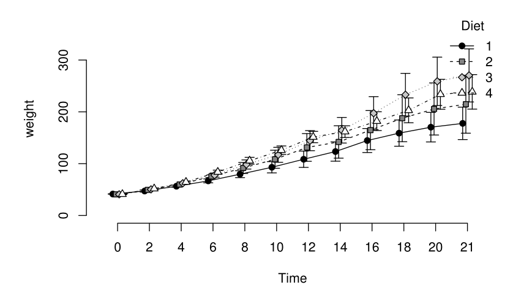

] 

.pull-right[

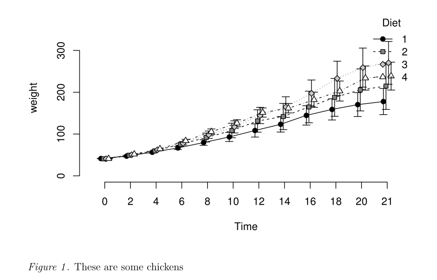

]


<!-- *********** NEW SLIDE ************** -->
---
## Your turn ! 

- Plot the ANOVA you calculated before using one of the built-in plot functions (`apa_beeplot(), apa_lineplot(), apa_barplot(), apa_factorial_plot()`)

<!-- *********** NEW SLIDE ************** -->
---
class: heading,middle

References


<!-- *********** NEW SLIDE ************** -->
---
class: small
## Cross-Referencing Figures, Tables and Equations

To reference figures and tables, you can use Markdown (or LaTeX). You just have to provide a name for the code chunk which creates the table/figure. For instance if your code chunk starts with `{r resTable1}` (avoid using _), you can reference the table with `\@ref(tab:resTable1)` (or `\@ref(fig:XY)`, or `\@ref(eg:XY)`).

Example:

.pull-left[


```{r eval = FALSE}

# See Figure \@ref(fig:figureExp1).
# 
# ##```{r figureExp1}
# plot(rnorm(50),rnorm(50))
# ##``
# 
# 
# Also see Equation \@ref(eq:mean).
# 
# \begin{equation}
# \bar{X} = \frac{\sum_{i=1}^n X_i}{n} (\#eq:mean)
# \end{equation}

```
]

.pull-right[
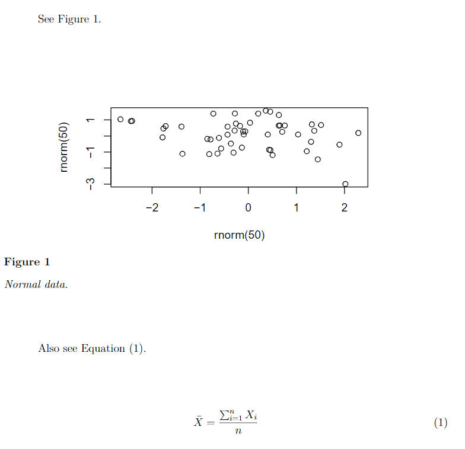
]


<!-- *********** NEW SLIDE ************** -->
---
## Literature References

- In order to cite articles, you need to have a bibliography in a `.bib` file
- Your `.bib` file must contain all of your references in `BibTeX` format.
- `BibTeX` format is just a way of defining an article’s citation information (name, authors, year, journal etc.) in a standardized way
- Example:

```{r eval=FALSE}
@article{rubin1996,
  title={Multiple imputation after 18+ years},
  author={Rubin, Donald B},
  journal={Journal of the American statistical Association},
  volume={91},
  number={434},
  pages={473--489},
  year={1996},
  publisher={Taylor \& Francis Group}
}
```

- Add your .bib-file in the YAML header. There can be multiple .bib-files

```{r eval=FALSE}
bibliography      : ["r-references.bib","library.bib"]
```

- Best way to get your .bib - file is via [Google Scholar](https://scholar.google.de/) or by exporting your Zotero/Citavi/etc. library.

<!-- *********** NEW SLIDE ************** -->
---
## References

Citations can be added  by using @ref syntax.

Citation type |     Syntax	 | Rendered citation
------------- |------------- | ------------- 
Citation within parentheses	| [@rubin1996] |	(Rubin, 1996)
Multiple citations	        |[@rubin1996; @bem2011]	|(Bem, 2011; Rubin, 1996) 
In-text citations	          | @rubin1996	 |Rubin (1996)
Year only	                  | [-@rubin1996]	 |(1996) 
With pre-/postfix           | [e.g., @rubin1996, etc.] | (e.g., Rubin, 1996, etc.) 

<!-- *********** NEW SLIDE ************** -->
---
## References

- Check out the `citr` [RStudio-addin](https://rstudio.github.io/rstudioaddins/) (also from Frederik Aust)

.center[

]


<!-- *********** NEW SLIDE ************** -->
---
## Quick Note: APA7

This is still work in progress, see the open issue [here](https://github.com/crsh/papaja/issues/342), for some tipps. For instance:

```{r eval=FALSE}
csl               : "apa.csl"
documentclass     : "apa7"
output            : papaja::apa6_pdf
```

already goes a long way.


<!-- *********** NEW SLIDE ************** -->
---
## Quick Note: Collaborative Working

- Greatest disadvantage so far
- Some possible solutions could be using [Github](https://github.com/) or [trackdown](https://ekothe.github.io/trackdown/)
- However, these require some technical skills from your supervisor/PI/colleague


<!-- *********** NEW SLIDE ************** -->
---
## Helpful references:

- Markdown: https://bookdown.org/yihui/rmarkdown
- Papaja: https://crsh.github.io/papaja_man/introduction.html#getting-started
- Tables with Kable: https://haozhu233.github.io/kableExtra/awesome_table_in_pdf.pdf
- Tables with Kable: https://cran.rstudio.com/web/packages/kableExtra/vignettes/awesome_table_in_html.html
- Papaja Tutorial: https://rpubs.com/YaRrr/papaja_guide

