```{r setup, include=FALSE, message = FALSE, warning=FALSE}
options(htmltools.dir.version = FALSE)
library(tidyverse)
library(gganimate)
library(papaja)
```


class: heading,middle

Part 3: Building interactive web apps in R with shiny

<!-- *********** NEW SLIDE ************** -->
---
## Shiny

Shiny

-  is a very powerful framework for building web applications based on `R`

-  combines the computational power of `R` with the interactivity of the modern web

-  is easy to write. No web development skills are required.


<!-- *********** NEW SLIDE ************** -->
---
## Shiny

Shiny applications can be useful, for example, 

- exploration
- communicating your results
- in teaching 
- making your methods accesible to other reasearchers


- Examples:
  - For statistics: http://www.shinyapps.org/
  - General: https://shiny.rstudio.com/gallery/


<!-- *********** NEW SLIDE ************** -->
---
## How to get started

After installing and loading the shiny package

```{r eval=FALSE}
install.packages("shiny")
```

you can create a shiny application with a default layout 


.center[
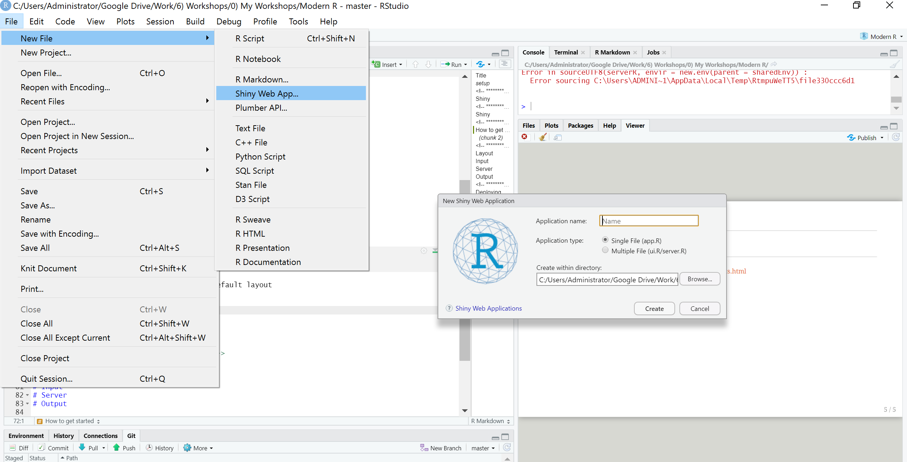
]


<!-- *********** NEW SLIDE ************** -->
---
## The structure

A shiny app consits of two parts:

- **UI**: The User-Interface  or front-end. Here you define the **layout** of your app, the possible **inputs**, as well as the **placements of outputs**. 

- **Server**: The server or back-end. This is where the magic happens. All computations and instructions how to build the output-objects are defined here. 


- (`shinyApp()`: Function which combines ui and server into an app.) 

- You can either create
  - **one** file called `app.R` containing all three parts
  - **two** files called `server.R`and `ui.R` containing only their respective parts.


<!-- *********** NEW SLIDE ************** -->
---
##  General idea of how it works

- In the `ui()` part you define the **layout** of your app, as well as possible **inputs**

- These inputs are saved as a **reactive value** in a named read-only `list`-object called `input`. For instance, in the default app the slider-input is called `bins`. The value of this input is then save in `input$bins`. 

- This `input`-list can then be accessed in the `server` part. 

- **Reactive** functions, like the `render()` functions then create **output** objects, which have to be saved in a named `list`-object called `output`. For instance, `output$distPlot <- renderPlot({})` creates a plot in `output$distPlot`

- These outputs can then be used in `Output()` functions of the `ui()` part (e.g., `plotOutput("distPlot")`, note the "" and the missing output$ part!)

- Each `render()` function has a corresponding `Output` function, e.g.:
  - renderPlot() - plotOutput()


- **Reactivity** (in short):  Reactive functions (e.g., `render()`, `reactive()`, `observeEvent()`, ` eventReactive()`) are triggered, when a reactive value changes. For instance, every time `input$bins` changes, `renderPlot()` is triggered. 


<!-- *********** NEW SLIDE ************** -->
---
## Most common (shiny related) errors

1. <font color ="red"> Error: object 'bins' not found </font> -> forgotten to use `input$bins` instead of `bins`

2.  <font color ="red"> Error: [...] :  Operation not allowed without an active reactive context. </font> -> when using `input$x` you always have to place it in a reactive-function

3.  Output is not shown -> make sure your `render()` and `Output()` functions match

4. <font color ="red">Warning: Error in dots_list: object 'output' not found</font> -> Did you put `output$x` in a Output-functiont and forgot the "" ? (i.e., `textOutput(output$x)` instead of `textOutput("x")`).

<!-- *********** Exercise ************** -->
---
## Your turn ! 

- Install `shiny` (if not already done) 
- Create and run your first shiny app


<!-- *********** HEADING ************** -->
---
class: heading,middle
Inputs


<!-- *********** NEW SLIDE ************** -->
---
class: small
## Free text


.pull-left[
Normal text input:

```{r eval = FALSE}
 textInput(inputId = "ID", 
           label   = "Please type your name here",
           value   = "", width = "100%",
           placeholder = "Hint: You can type here text")
```

.center[
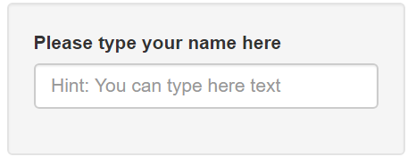
]

]
.pull-right[

Long text input:

```{r eval = FALSE}
textAreaInput(inputId = "ID", 
              label   = "Tell something about yourself",
              value   = "", 
              rows    = 5)
```

.center[
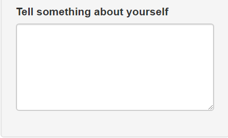
]


]


<!-- *********** NEW SLIDE ************** -->
---
## Numeric inputs

.pull-left[
Numeric input:

```{r eval = FALSE}
numericInput(inputId = "num",
             label   = "How old are you ?",
             value   = 50, min = 0,
             max     = 100)
```

.center[
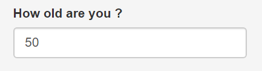
]

]
.pull-right[

Slider input:

```{r eval = FALSE}
sliderInput(inputId ="slider",
            label   = "How old are you ?",
            min     = 0, max = 100,
            value   = 50,step = 1)
  
```

.center[
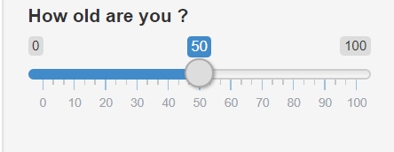
]


]


<!-- *********** NEW SLIDE ************** -->
---
class: small
## Choices

There are different ways to implement choice options:

.pull-left[

```{r eval=FALSE}
selectInput(inputId = "select",
            label   = "Are you a cat or a dog person?",
            choices = c("cat","dog")),


selectInput(inputId  = "select",
            label    = "Are you a cat or a dog person?",
            choices  = c("cat","dog","fish"),
            multiple = TRUE),


radioButtons(inputId ="radio",
             label   = "Are you a cat or a dog person?",
             choices = c("cat","dog")),


checkboxGroupInput(inputId ="checkbox",
                   label   = "Are you a cat or a dog?",
                   choices = c("cat","dog"))
```

]
.pull-right[


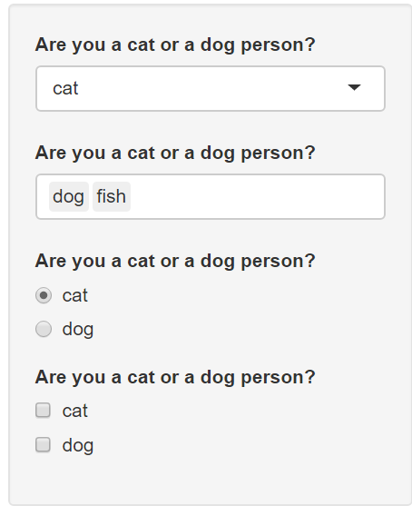


]


<!-- *********** NEW SLIDE ************** -->
---
## File uploads

Users can also upload files:


```{r eval=FALSE}
fileInput(inputId  = "file_data",
          label    = "Choose some file",
          multiple = FALSE,
          accept   = c(".rds", ".csv"))
```

.center[
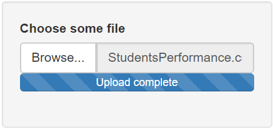
]

There are also ways to [implement download-buttons](https://shiny.rstudio.com/reference/shiny/1.0.4/downloadButton.html)

<!-- *********** NEW SLIDE ************** -->
---
## Action Buttons

And there can be buttons (with [icons!](https://fontawesome.com/icons))

```{r eval=FALSE}
actionButton(inputId = "startbutton",
             label   = "Start Simulation",
             icon    = icon("laptop-code"))
```

.center[
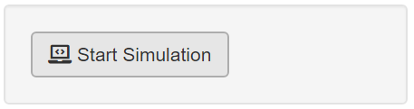
]


Buttons are most often used in combination with `observeEvent()` or `eventReactive()` in the server function, for instance, to only update the output after a button is pressed, or to clear all user inputs (we will have some examples later)


<!-- *********** NEW SLIDE ************** -->
---
## Select varibales from a data.frame

There are also convenient ways to let users select variables from a data.frame (however `selectInput()` also works)

```{r eval=FALSE}
varSelectInput(inputId = "selectVars",
               label   = "Select the variables you want to plot",
               data    = ChickWeight)
```


.center[
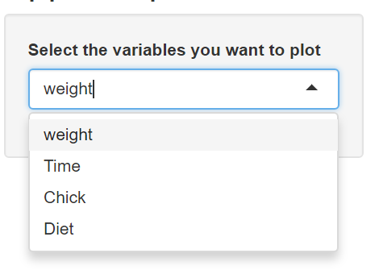
]


Note that you have to use [tidyeval, non-standard evaluation](https://tidyeval.tidyverse.org/dplyr.html) in tidyverse functions:  `select(!!input$selectVars)`


<!-- *********** Exercise ************** -->
---
## Your turn ! 

Open the `input_exercise_app.R` file. The file contains an almost finished shiny. It is your task, to fill in the missing inputs ! The app displays the log sum of PhDs awarded by field for each year. 

1. Define a **file-upload input** with the ID `dataset`, where people can upload the dataset. We are using the [`phd_by_field.csv`](https://github.com/rfordatascience/tidytuesday/tree/master/data/2019/2019-02-19) data in the `Data` folder.

2. Define an **slider input** ranging from 2008 to 2017 with the ID `year`, where the user can select the range of years to include in the plot. Tipp: supply a vector of length two, to make a "range"-slider (e.g., `value = c(40, 60)`)

3. Define a **drop-down input** with the ID `groupBY`, where the user can select the grouping variable from the variables `field`, `broad_field` or `major_field`

4. Define a **numeric input** with the ID `phd_filter`, where the user can specify the top *n* groups to include in the plot (set the defaul to 5).

5. Define a **radio-button input** with the ID `palette`, where the user can select one of the following `ggplot` coloring pallets: `c("Set1","PiYG","Greys")`

6. Finally, create a **free-text input** with the ID `title`, where the user can specify the title of her plot.  


<!-- *********** HEADING ************** -->
---
class: heading,middle
Outputs

<!-- *********** New Slide ************** -->
---
## Outputs

- The outputs you define in the UI create placeholders that are later filled by the server function.

- Outputs take a unique ID character as their argument: If you created and assigned a plot in your server function to `output$plot`, you can access it via the ID `"plot"` in your output function.

- Each output function in the UI  has a corresponding render function in the server function:

  - renderPlot()  - plotOutput() 
  - renderPlotly() - plotlyOutput()
  
  - renderText()  - textOutput()
  - renderPrint() - verbatimTextOutput()
  
  - renderTable() - tableOutput()
  - renderDataTable() - datatableOutput()

<!-- *********** New Slide ************** -->
---
## Plots

  - renderPlot()  - plotOutput() 
  - renderPlotly() - plotlyOutput()

<!-- *********** New Slide ************** -->
---
class:small
## Plots

.pull-left[
In `server()`:

```{r eval = FALSE }
output$plot <- renderPlot({
                  ggplot(mtcars, aes(x = mpg, y = hp)) +
                    geom_point()+ theme_bw()
})
```

in `ui()`:

```{r eval = FALSE}
plotOutput("plot")
```


Result: 

.center[
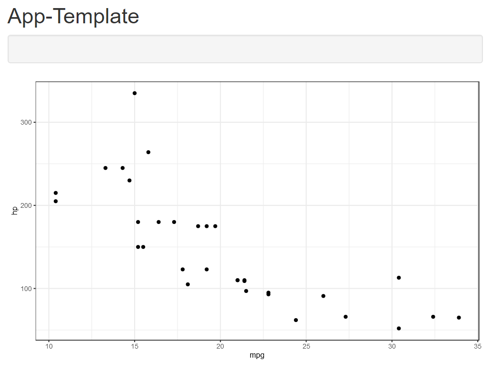
]

]

.pull-right[
In `server()`:

```{r eval = FALSE }
output$plot <- renderPlotly({
             p <- ggplot(mtcars, aes(x = mpg, y = hp)) +
                   geom_point()+ theme_bw()
             ggplotly(p)
})
```

in `ui()`:

```{r eval = FALSE}
plotlyOutput("plot")
```


Result: 

.center[
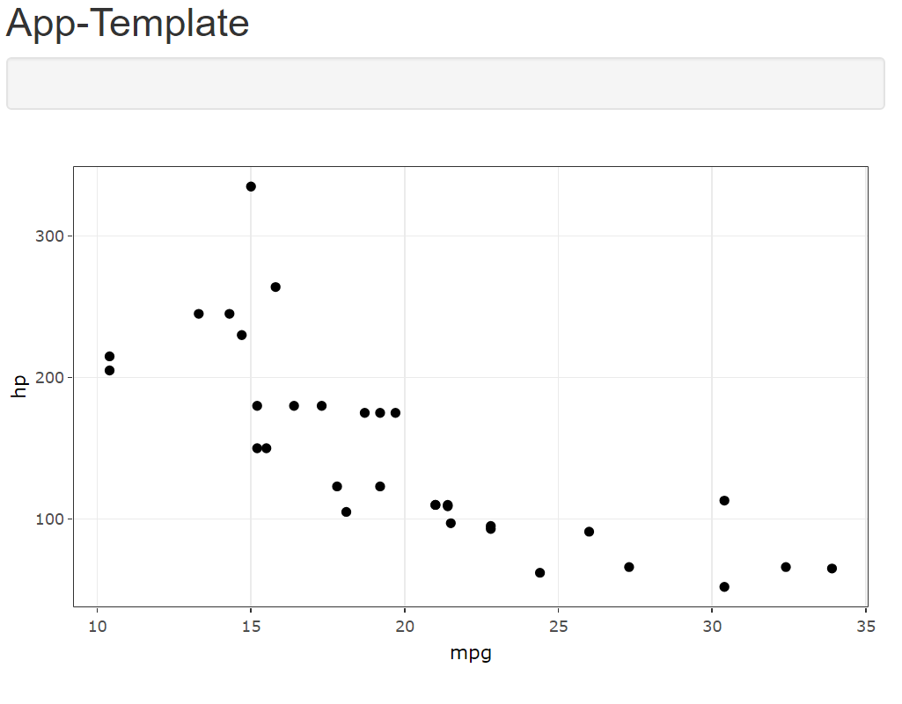
]

]

<!-- *********** New Slide ************** -->
---
class:small
## Tables

From the [manual](https://mastering-shiny.org/basic-ui.html#outputs): 

renderTable() - tableOutput():

- render a static table of data, showing all the data at once.
- most useful for small, fixed summaries (e.g., model coefficients)

renderDataTable() - datatableOutput(): 

- render a dynamic table, showing a fixed number of rows along with controls to change which rows are visible.
- is most appropriate if you want to expose a complete data frame to the user.
  


<!-- *********** New Slide  ************** -->
---
class:small
## Tables

.pull-left[
In `server()`:

```{r eval = FALSE }
output$table <- renderTable({
                  mtcars
})
```

in `ui()`:

```{r eval = FALSE}
tableOutput("table")
```


Result: 

.center[
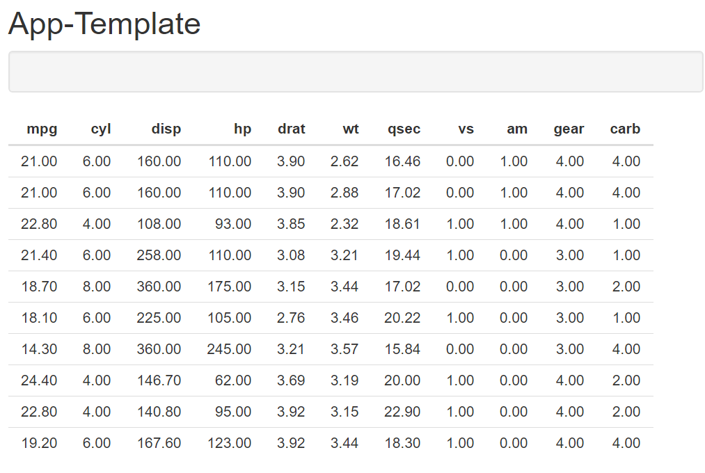
]

]

.pull-right[
Using [datatable](https://rstudio.github.io/DT/) from the package `DT`. In `server()`:

```{r eval = FALSE }
output$table <- renderDataTable({
            mtcars
})
```

in `ui()`:

```{r eval = FALSE}
dataTableOutput("table")
```


Result: 

.center[

]

]

<!-- *********** New Slide ************** -->
---
## Text

- renderText(): displays text *returned* by the code.
- renderPrint(): which displays text *printed*  by the code.

<!-- *********** New Slide ************** -->
---
class:small
## Text

.pull-left[
In `server()`:

```{r eval = FALSE }
output$text<- renderText({
  "What sound does a sleeping T-Rex make?  A dino-snore."
})
```

in `ui()`:

```{r eval = FALSE}
textOutput("text")
```


Result: 

.center[
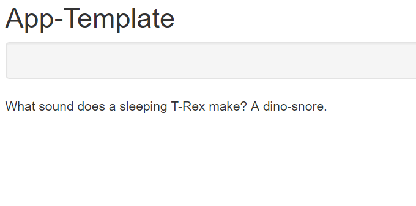
]

]

.pull-right[
**BUT** In `server()`:

```{r eval = FALSE }
output$text <- renderText({
             t.test(mpg ~ vs, mtcars) #<< #<<
})
```

in `ui()`:

```{r eval = FALSE}
textOutput("text")
```


Result: 

.center[
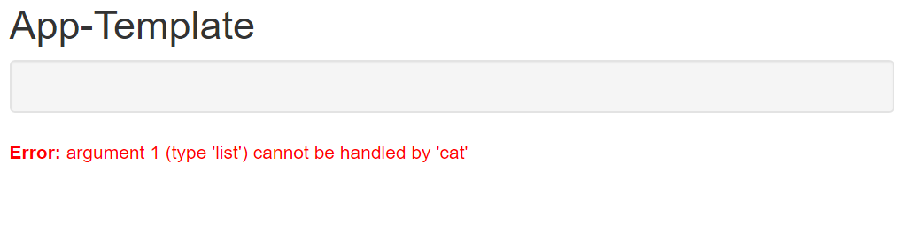
]

]


<!-- *********** New Slide ************** -->
---
class:small
## Text

.pull-left[
In `server()`:

```{r eval = FALSE }
output$text<- renderText({
  "What sound does a sleeping T-Rex make?  A dino-snore."
})
```

in `ui()`:

```{r eval = FALSE}
textOutput("text")
```


Result: 

.center[

]

]

.pull-right[
**Better**: In `server()`:

```{r eval = FALSE }
output$text <- renderPrint({ # <<<
             t.test(mpg ~ vs, mtcars) #<< #<<
})
```

in `ui()`:

```{r eval = FALSE}
 verbatimTextOutput("text") # <<
```


Result: 

.center[
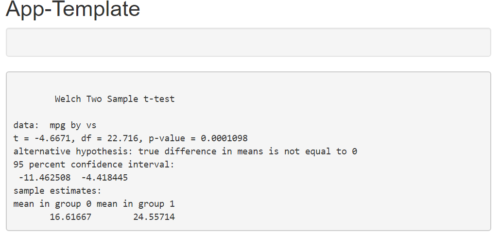
]

]


<!-- *********** New Slide ************** -->
---
class:small
## Text

Example from the [manual](https://mastering-shiny.org/basic-ui.html#outputs) : 

.pull-left[

In `server()`

```{r eval = FALSE}
print_and_return <- function() {
    print("a")
    print("b")
    return("c")
}


# <--- here goes the rest ---> # 
output$text <- renderText({
   
    x <- print_and_return()
    x    
})

output$print <- renderPrint({
    
    x <- print_and_return()
    x    
})
```
]
.pull-right[

**Result:**

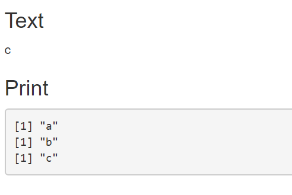

 Remember: A function can print multiple things, but can only return a single value
 
 This can be important for `Warning` messages, since they are often only printed but not returned.
 
Example: 
 
```{r eval=FALSE}
a <- rbeta(1,-1,1) # Warning is printed
a # No warning
```
 
 
]


<!-- *********** Exercise ************** -->
---
## Your turn ! 

Open the file `output_exercise_app.R`. When you run the app, you see that I already defined three outputs:  plot, results, and raw data. Your task is it to supply the missing `render()` (in the server part) and `Output` functions (in the UI part).  I already wrote some code snippets for you, which you can use if you want. We don't need inputs this time.


<!-- *********** HEADING ************** -->
---
class: heading,middle
Layout

<!-- *********** NEW SLIDE ************** -->
---
## Layout

... or how to arrange your inputs and outputs with `fluidPage()`.

We will talk about three ways to organize your app:
- Sidebar Layout
- Grid Layout
- Tabsets

For more information you can go [here](https://shiny.rstudio.com/articles/layout-guide.html)

<!-- *********** NEW SLIDE ************** -->
---
## Sidebar Layout

This is the simple default layout you already now from the previous tasks. The layout is created by the following functions:

- `sidebarLayout()`, which sets the general layout
- `titlePanel()`, which sets a title
- `sidebarPanel()`, defines the side bar
- `mainPanel()`, defines the main panel

The result is a two-column layout with inputs on the left (or right with `position = "right"`) and outputs on the right, as shown in this Figure  (Figure 3.1 from [https://mastering-shiny.org/](https://mastering-shiny.org/basic-ui.html#layout):


.center[

]


<!-- *********** Exercise ************** -->
---
## Grid Layout

`sidebarLayout()` described before makes use of Shiny’s lower-level grid layout functions. These allow 
custom application layouts using the Shiny grid layout system. The main functions are:

- `fluidPage()`
- `fluidRow()`
- `column() `
- (`wellPanel()`: Creates a panel with a slightly inset border and grey background.)

.center[

]

Figure 3.2 from [https://mastering-shiny.org/](https://mastering-shiny.org/basic-ui.html#layout)


<!-- *********** Exercise ************** -->
---
## Grid Layout

Note: The column widths are based on the Bootstrap 12-wide grid system, so should add up to 12 within a `fluidRow()` container. 

Lets look at the examples in `example_layouts_sidebar_with_grid.R` and `example_layouts_with_grid.R`

<!-- *********** NEW SLIDE ************** -->
---
class:small
## Tabsets

- Can be used in combination with the grid and sidebar layout.
- Allows to subdivide the UI into discrete sections
- Functions:
  - `tabsetPanel()`: Start of the tabset panels
  - `tabPanel("ID",):` Single tabset panel

<!-- *********** NEW SLIDE ************** -->
---
class:small
## Tabsets - Example in example_tabset.R

.pull-left[
```{r eval = FALSE}
ui <- fluidPage(

  fluidRow(
    
    column(4,
           wellPanel(
             sliderInput("sd", "SD:",
                         min = 0,
                         max = 100,
                         value = 4),
             
           )       
    ),
    
    column(8,
      tabsetPanel(
        tabPanel("Normal",
          
          plotOutput("norm")
           
        ), 
        tabPanel("Beta",
          
          plotOutput("beta")
          
        )
      ) # end tabsetPanel
    ) # end column
  ) # end fluidRow 
) # end fluidPage
```
]
.pull-right[
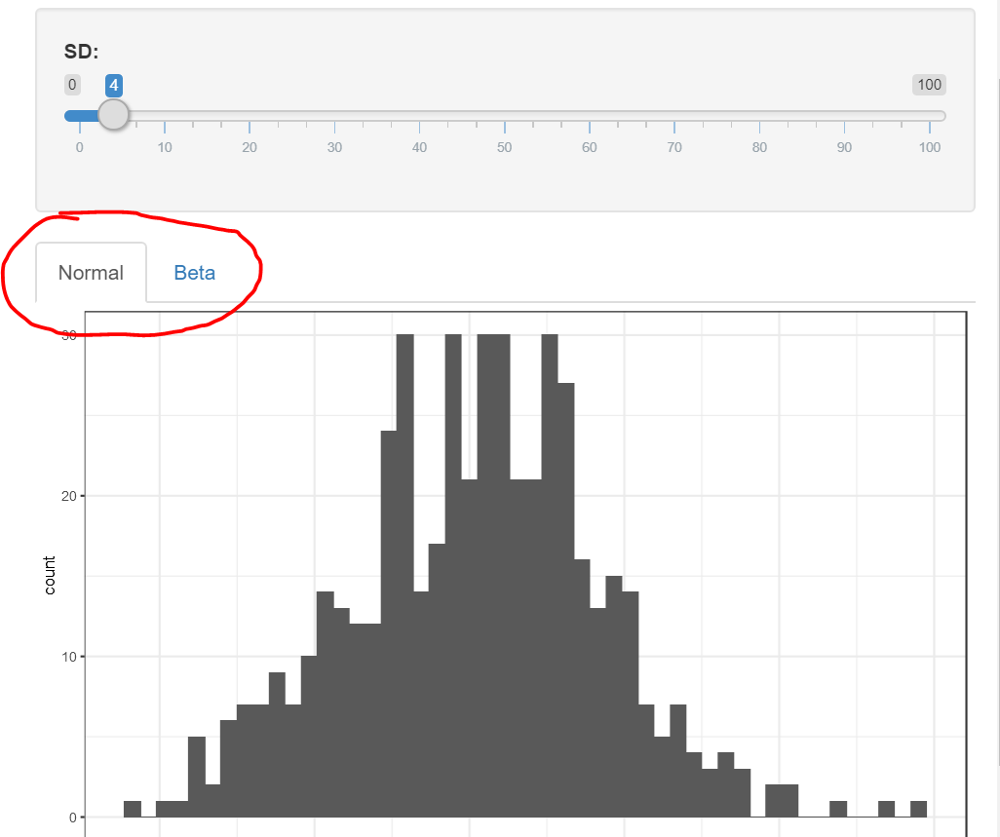
]


<!-- *********** NEW SLIDE ************** -->
---
class:small
## Conditional Panels 

- Columns can be made conditional on the selected tab with `conditionalPanel()`
- You have to give your  tabsetPanel an ID: `tabsetPanel(id ="tabs1", ...)`
- Then you can condition on this ID via: `conditionalPanel("input.tabs1 == 'TabName'"`
- Example in Example in `example_tabset_cond.R`

.pull-left[
```{r eval=FALSE}
column(4,
conditionalPanel("input.tabs1 == 'Normal'",
  sliderInput("mu", "M:",  value = 5), 
  sliderInput("sd", "SD:", min = 0, value = 4)),        

conditionalPanel("input.tabs1 == 'Beta'",
  numericInput("a", "A:", min = 0,value = 5), 
  numericInput("b", "B:", min = 0,value = 4))
),
column(8,
  tabsetPanel(id ="tabs1",
    tabPanel("Normal",plotOutput("norm")), 
    tabPanel("Beta",plotOutput("beta"))
  )
)
```
]
.pull-right[

.center[
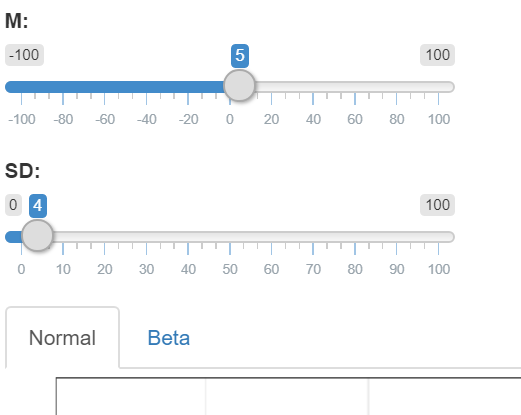
***
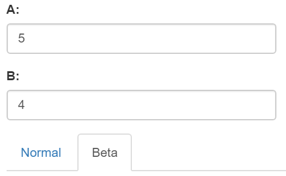
]

]


<!-- *********** NEW SLIDE ************** -->
---
## Themes

You can also set a different theme in your UI by using the theme argument inside `fluidPage()`


```{r eval=FALSE}
theme = shinythemes::shinytheme("darkly")
```


Try out different themes [here](https://shiny.rstudio.com/gallery/shiny-theme-selector.html)

<!-- *********** NEW SLIDE ************** -->
---
## HTML + Markdown

You can also integrate HTML and Markdown elements in your UI, for example:

- `h1():h6()` for different headings
- `p()`  for text blocks
- `br()` line breaks
- `img()` for images
- `strong()` for bold text 
- `includeMarkdown("this_is_a_markdown_file.md")` ()

See `? builder()` for more information.


.pull-left[

```{r eval = FALSE}
sidebarPanel(
           
 h1("Here comes some text"),
 p(" this is some text",
   em("this is important"),
   strong("this too")),
 hr(),
 h3("Code"),
 code("1+1=2")
       
)
```


]

.pull-right[

.center[
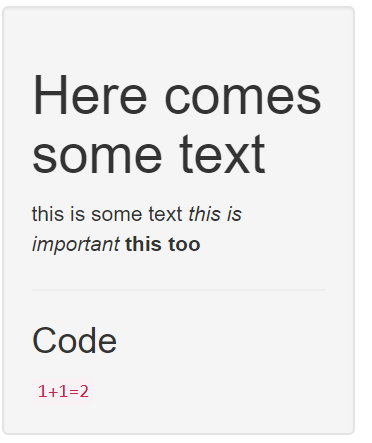
]

]


<!-- *********** Exercise ************** -->
---
## Your turn ! 

Take one of the apps you created in one of the previous exercises (or use the default app) and change its layout using, either the grid Layout **or** tabsets.

<!-- *********** HEADING ************** -->
---
class: heading,middle
Server & Reactivity

<!-- *********** NEW SLIDE ************** -->
---
## Server & Reactivity

- Reactive values (i.e., `input$`) have to be in a **reactive expression** (e.g. `renderPlot()`, `reactive()`)

- **Static** code like loading packages, datasets, or sourcing external functions **don't** need to be in a reactive expression (and it is recommend to not do so)

- Reactive expressions make the shiny app more efficient, since recomputations only happen when inputs change. 

- Results of reactive expressions can be used as outputs or in other reactive expressions 


Lets look at some examples based on https://mastering-shiny.org/basic-reactivity.html (see also [here](https://shiny.rstudio.com/articles/reactivity-overview.html))


<!-- *********** NEW SLIDE ************** -->
---
## Server & Reactivity

Lets look at `example_reactivity_1.R`. The reactivity graph looks like this:

.center[

]


The output of `hist` changes if any of the inputs (`mu1,sd1,n1,mu2,sd2,n2,bins`) changes. The output of `ttest` changes if any of the inputs **except** `bins` changes.

What are the problems with this ? 

<!-- *********** NEW SLIDE ************** -->
---
## Server & Reactivity
.pull-left[

Lets look at `example_reactivity_2.R`. The reactivity graph looks like this:

.center[

]
]

.pull-right[

I pulled out the repeated `rnorm` computation into two new reactive expressions inside `reactive()` and  assigned the results to two new objects `x1` and `x2`. 

```{r eval = FALSE}
x1 <- reactive( 
  rnorm(input$n1, input$mu1, input$sd1)
) 
```

This created three independent modules, which can be recomputed independtly -> increase efficiency. Note: To later use the results from `reactive()`, you have to call the variable like it’s a function, e.g. `x1()`.

```{r eval = FALSE }
t.test(x1(),x2()) 
```


]

<!-- *********** NEW SLIDE ************** -->
---
## Server & Reactivity

.pull-left[
Lets look at the last examples `example_reactivity_3.R`. The reactivity graph looks like this:

.center[

]
]

.pull-right[
 Here I added an `actionButton`  as input in the UI

```{r eval = FALSE }
actionButton(inputId = "sim",
             label   = "Start Simulation",
             icon    = icon("laptop-code"))
```

I then made the computation of `x1` and `x2`dependnt on this action button

```{r eval = FALSE}
 x1 <- eventReactive(input$sim, {
    rnorm(input$n1, input$mu1, input$sd1) 
})
```

Why not just like this ? 

```{r eval = FALSE}
x1 <- reactive( 
  input$sim,
  rnorm(input$n1, input$mu1, input$sd1)
) 
```

]
<!-- *********** Exercise ************** -->
---
## Your turn ! 


Your task is it to create an app which does an k-means clustering analysis on the [happiness2017](https://www.kaggle.com/unsdsn/world-happiness/version/2#2017.csv) data we had before. 

The app should have three inputs:

- Select variable 1
- Select variable 2
- Number of clusters

And three outputs: 

- Plot of the k-means results, i.e. scatterplot of the two variables, colored by cluster (+ centroid of clusters)
- Raw results of the k-means algorithm
- Raw data (to better see the possible variable inputs and their values)


The layout is totally up to you.

<!-- *********** Exercise ************** -->
---
## Tipps

You can load data (e.g., `read.csv("Part 3 - Shiny/Data/happines2017")`) and create variables  which you can access in your entire app (for instance in the choice options  in selectInput), when you insert the code before the `ui`.

`kmeans(x = data,centers = k)`  from base `R`


If you have a data.frame (`temp`) with two variables and the results of the `kmeans()` function (`kmeans`), this might be a way to plot it:

```{r eval=FALSE}
temp$cluster <-  factor(kmeans$cluster)
    
        
ggplot(temp,aes_string(x = input$var1, y = input$var2, color = "cluster")) +
    geom_point() +
    geom_point(data=data.frame(kmeans$centers),
               color = "black",
               shape = 4,
               size  = 4) +
    theme_bw()

```


<!-- *********** HEADING ************** -->
---
class: heading,middle

Publishing your Shiny App


<!-- *********** NEW SLIDE ************** -->
---
## Deploying your app

You can deploy your shiny app either by having your own [shiny server](https://rstudio.com/products/shiny/shiny-server/?_ga=2.165307323.56038037.1588581253-1556918011.1538985794) , or by using an external server like [shinyapps.io](https://www.shinyapps.io/?_ga=2.165307323.56038037.1588581253-1556918011.1538985794)

[shinyapps.io](https://www.shinyapps.io/?_ga=2.165307323.56038037.1588581253-1556918011.1538985794) is a platform as a service (PaaS) for hosting Shiny web apps (applications). They also offer a free plan.

To host your shiny app there you need to:

- make an account at [shinyapps.io](https://www.shinyapps.io/?_ga=2.165307323.56038037.1588581253-1556918011.1538985794)

- install the  `rsconnect` R package


<!-- *********** NEW SLIDE ************** -->
---
## Deploying your app

If you have an account (you don't have to do it) and installed `rsconnect` [this](https://shiny.rstudio.com/articles/shinyapps.html) is how you host your app: 

- You have to configure the `rsconnect` package to use your account:
  - Click the show button on the token page of your shiny.io - dashboard.
  - A window will pop up that shows the full command to configure your account.
  - Copy  and then paste it into the Console of RStudio and click enter.

- run `deployApp()`  or use the blue `Publish` button.

- **Note:**
  - If you have additional files you use in your app (images, data sets, `.R`files, `.css` files), they need to be in a subdirectory called **www** in your app directory
  - your app must be named **app.R**

Your app folder layout should be like this:

```{r eval=FALSE}

cool_shiny_app:
  |- app.R
  |- www
      | - image1.png
      | - cool_data.csv
```


<!-- *********** NEW SLIDE ************** -->
---
## Helpful references
- https://mastering-shiny.org
- https://bookdown.org/yihui/rmarkdown/shiny-documents.html
- Check out the many examples here: https://shiny.rstudio.com/gallery/ (scroll down)
- https://github.com/daattali/advanced-shiny
- https://shiny.rstudio.com/articles/layout-guide.html